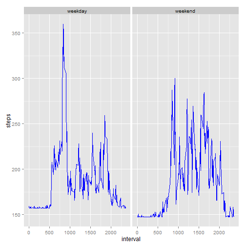

##Loading and preprocessing the data


```r
activity<-read.csv("project1/activity.csv",sep=",",na.strings="NA")
startactivity<-head(activity)
print(startactivity,type="html")
```

```
##   steps       date interval
## 1    NA 2012-10-01        0
## 2    NA 2012-10-01        5
## 3    NA 2012-10-01       10
## 4    NA 2012-10-01       15
## 5    NA 2012-10-01       20
## 6    NA 2012-10-01       25
```

##What is mean total number of steps taken per day?
**For this part of the assignment, you can ignore the missing values in the dataset.**


```r
activitynona<-na.omit(activity) 
```

**Calculate the total number of steps taken per day**

```r
stepsxday<-aggregate(steps ~ date, data=activitynona,sum)
```

**Make a histogram of the total number of steps taken each day**

```r
hist(stepsxday$steps,col="red",xlab="Steps each day",main="Total number of steps each day",breaks=90)
axis(1,at=c(0,5000,10000,15000,20000,21200))
rug(stepsxday$steps)
```

 

**Calculate and report the mean and median of the total number of steps taken per day**


```r
meansteps<-aggregate(steps ~ date, data=activitynona,mean)
hist(meansteps$steps,col="red",xlab="Mean Steps each day",main="Mean and Median of total number of steps each day",breaks=90)
axis(1,at=c(0,20,40,60,75))
rug(meansteps$steps)
abline(v=median(meansteps$steps),col="magenta",lwd=6)
legend("topright",lty=1,col="magenta",legend=c("Median"))
```

 

##What is the average daily activity pattern?
**Make a time series plot of the 5-minute interval (x-axis) and the average number of steps taken, averaged across all days (y-axis)**


```r
meanstepsxinterval<-aggregate(steps ~ interval, data=activitynona,mean)
plot(meanstepsxinterval$interval,meanstepsxinterval$steps,xlab="Interval 5minute-interval",ylab="Average steps for all days",main="Average steps all day for 5 min interval",col="blue",type='l')
axis(1,at=c(0,500,1000,2000,2400))
```

 

**Which 5-minute interval, on average across all the days in the dataset, contains the maximum number of steps?**


```r
library(dplyr)
maxaveragesteps<-filter(meanstepsxinterval,steps==max(steps))
intervalmaxaveragesteps<-maxaveragesteps$interval
intervalmaxaveragesteps
```

```
## [1] 835
```

##Imputing missing values

**Calculate and report the total number of missing values in the dataset (i.e. the total number of rows with NAs)**


```r
nafinal<-activity[is.na(activity$steps),]
nadataset<-nrow(nafinal)
nadataset
```

```
## [1] 2304
```

**Devise a strategy for filling in all of the missing values in the dataset. The strategy does not need to be sophisticated. For example, you could use the mean/median for that day, or the mean for that 5-minute interval, etc.**

**Create a new dataset that is equal to the original dataset but with the missing data filled in**


```r
library(data.table)
library(xtable)
```

```
## Warning: package 'xtable' was built under R version 3.2.2
```

```r
activityclone<-data.table(activity)
activityclone$steps[is.na(activityclone$steps)]<-activityclone[,mean(activityclone$interval)]
startactivityclone<-head(activityclone)
print(startactivityclone,type="html")
```

```
##     steps       date interval
## 1: 1177.5 2012-10-01        0
## 2: 1177.5 2012-10-01        5
## 3: 1177.5 2012-10-01       10
## 4: 1177.5 2012-10-01       15
## 5: 1177.5 2012-10-01       20
## 6: 1177.5 2012-10-01       25
```

**Make a histogram of the total number of steps taken each day**


```r
stepsxdaynew<-aggregate(steps ~ date, data=activityclone,sum)
hist(stepsxdaynew$steps,col="green",xlab="Steps each day",main="Total number of steps each day",breaks=90)
```

 

**Calculate and report the mean and median total number of steps taken per day.**


```r
meanstepsnew<-aggregate(steps ~ date, data=activityclone,mean)
hist(meanstepsnew$steps,col="green",xlab="Mean Steps each day",main="Mean and Median of total steps each day",breaks=90)
abline(v=median(meanstepsnew$steps),col="magenta",lwd=3)
legend("topright",lty=1,col="magenta",legend=c("Median"))
```

 

##Are there differences in activity patterns between weekdays and weekends?

**Create a new factor variable in the dataset with two levels - "weekday" and "weekend" indicating whether a given date is a weekday or weekend day.**


```r
library(lubridate)
library(xtable)

meanstepsnew<-aggregate(steps ~ date, data=activityclone,mean)

meanstepsnew$date<-as.Date(meanstepsnew$date)

meanstepsnew$typeday<-weekdays(meanstepsnew$date)

meanstepsnew$typeday[meanstepsnew$typeday=="lunes"]<-"weekday"
meanstepsnew$typeday[meanstepsnew$typeday=="martes"]<-"weekday"
meanstepsnew$typeday[meanstepsnew$typeday=="miércoles"]<-"weekday"
meanstepsnew$typeday[meanstepsnew$typeday=="jueves"]<-"weekday"
meanstepsnew$typeday[meanstepsnew$typeday=="viernes"]<-"weekday"
meanstepsnew$typeday[meanstepsnew$typeday=="sábado"]<-"weekend"
meanstepsnew$typeday[meanstepsnew$typeday=="domingo"]<-"weekend"
meanstepsnew$typeday<-as.factor(meanstepsnew$typeday)

startmeanstepsnew<-head(meanstepsnew)
print(startmeanstepsnew,type="html")
```

```
##         date      steps typeday
## 1 2012-10-01 1177.50000 weekday
## 2 2012-10-02    0.43750 weekday
## 3 2012-10-03   39.41667 weekday
## 4 2012-10-04   42.06944 weekday
## 5 2012-10-05   46.15972 weekday
## 6 2012-10-06   53.54167 weekend
```

**Make a panel plot containing a time series plot of the 5-minute interval (x-axis) and the average number of steps taken, averaged across all weekday days or weekend days (y-axis)**


```r
library(lubridate)
library(ggplot2)

meanstepsnew<-aggregate(steps ~ date +interval, data=activityclone,mean)

meanstepsnew$date<-as.Date(meanstepsnew$date)

meanstepsnew$typeday<-weekdays(meanstepsnew$date)

meanstepsnew$typeday[meanstepsnew$typeday=="lunes"]<-"weekday"
meanstepsnew$typeday[meanstepsnew$typeday=="martes"]<-"weekday"
meanstepsnew$typeday[meanstepsnew$typeday=="miércoles"]<-"weekday"
meanstepsnew$typeday[meanstepsnew$typeday=="jueves"]<-"weekday"
meanstepsnew$typeday[meanstepsnew$typeday=="viernes"]<-"weekday"
meanstepsnew$typeday[meanstepsnew$typeday=="sábado"]<-"weekend"
meanstepsnew$typeday[meanstepsnew$typeday=="domingo"]<-"weekend"
meanstepsnew$typeday<-as.factor(meanstepsnew$typeday)
meanstepsweek<-aggregate(steps ~ interval+typeday, data=meanstepsnew,mean)

g<-ggplot(meanstepsweek,aes(interval,steps))
g+geom_line(color="blue")+facet_grid(.~typeday)
```

 
